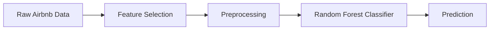
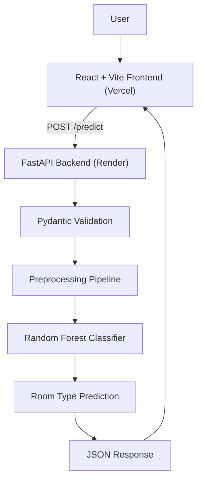
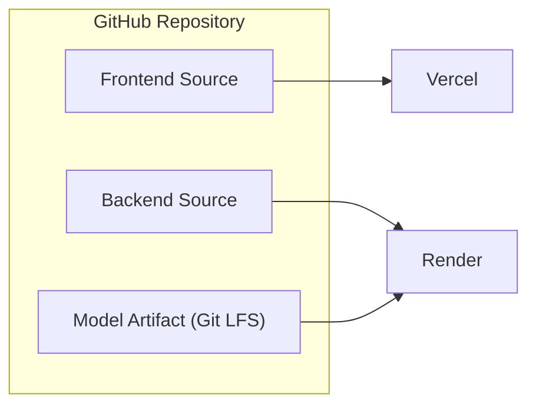

# 🏠 Airbnb Room Type Predictor

**An end-to-end Machine Learning web application that predicts Airbnb `room_type` from listing data — powered by a Random Forest Classifier, served through a FastAPI backend, and delivered through a React + TypeScript frontend.**

<p align="left">
  <a href="https://airbnb-room-type-predictor-phi.vercel.app/"><b>🌐 Live App</b></a> ·
  <a href="https://airbnb-room-type-predictor-w51s.onrender.com/docs"><b>📄 API Docs</b></a> ·
  <a href="https://github.com/codeswith-pawan/airbnb-room-type-predictor"><b>💻 Source Code</b></a>
</p>

<p align="left">
  
  
  
  
  
  
  
  
  
  
</p>

---

## 🚀 Live Demo

| Resource | Link |
|---|---|
| 🖥️ **Frontend (React + Vite)** | [airbnb-room-type-predictor-phi.vercel.app](https://airbnb-room-type-predictor-phi.vercel.app/) |
| ⚙️ **Backend API (FastAPI)** | [airbnb-room-type-predictor-w51s.onrender.com](https://airbnb-room-type-predictor-w51s.onrender.com/) |
| 📄 **Swagger / OpenAPI Docs** | [airbnb-room-type-predictor-w51s.onrender.com/docs](https://airbnb-room-type-predictor-w51s.onrender.com/docs) |

> ⚠️ The backend is hosted on Render's free tier — the first request after a period of inactivity may take a few seconds while the server spins up.

---

## 📖 Project Overview

**Airbnb Room Type Predictor** is a full-stack machine learning application that classifies an Airbnb listing's `room_type` (e.g. *Entire home/apt*, *Private room*, *Shared room*, *Hotel room*) based on ten listing attributes — location, pricing, availability, and review activity.

The project covers the complete ML product lifecycle:

- **Data preprocessing & model training** with a scikit-learn `Pipeline`
- **Hyperparameter tuning** via `RandomizedSearchCV`
- **Model serialization** with Git LFS
- **A production REST API** built with FastAPI and validated with Pydantic
- **A typed, responsive frontend** built with React, TypeScript, and Tailwind CSS
- **Cloud deployment** — frontend on Vercel, backend on Render

---

## ✨ Key Features

- 🎯 Predicts Airbnb `room_type` from 10 real listing features
- 🧠 Random Forest Classifier trained with class imbalance handling and cross-validated hyperparameter search
- ⚡ FastAPI backend with automatic OpenAPI/Swagger documentation
- ✅ Request validation with Pydantic — malformed input is rejected before it reaches the model
- 🌐 CORS configured for both local development and the production frontend
- 💻 Modern React + TypeScript dashboard UI with client-side field validation
- ☁️ Fully deployed, publicly accessible frontend and backend
- 📦 Large model artifact tracked with Git LFS instead of bloating the repo

---

## 🎯 Why This Project

Room type is one of the strongest signals for how an Airbnb listing will be used, priced, and booked — but it isn't always labeled consistently or provided by hosts. This project explores whether room type can be **inferred from structural listing data** (location, pricing, availability, and host/review activity) rather than relying on free-text descriptions.

Beyond the ML problem itself, the project was built to demonstrate an **end-to-end, production-style ML workflow**: a trained scikit-learn pipeline is not left as a notebook artifact — it's wrapped in a validated API and shipped behind a real frontend, deployed on real infrastructure.

---

## 🔬 Machine Learning Workflow



**Pipeline details:**

- Preprocessing and modeling are combined into a single **scikit-learn `Pipeline`**, so the exact transformations applied during training are reproduced automatically at inference time.
- **Categorical features** (`neighbourhood_group`, `neighbourhood`) and **numerical features** (latitude, longitude, price, etc.) are preprocessed separately within the pipeline.
- The classifier is a **`RandomForestClassifier`** trained with **`class_weight="balanced"`** to account for uneven class distribution across room types.
- The complete fitted pipeline (preprocessing + model) is serialized to a single artifact:
  ```
  backend/random_forest_model.pkl
  ```

---

## 📊 Features Used

| # | Feature | Type | Description |
|---|---|---|---|
| 1 | `neighbourhood_group` | Categorical | Borough / broad area of the listing |
| 2 | `neighbourhood` | Categorical | Specific neighbourhood of the listing |
| 3 | `latitude` | Numerical | Geographic latitude |
| 4 | `longitude` | Numerical | Geographic longitude |
| 5 | `price` | Numerical | Listed nightly price |
| 6 | `minimum_nights` | Numerical | Minimum nights required per booking |
| 7 | `number_of_reviews` | Numerical | Total number of reviews received |
| 8 | `reviews_per_month` | Numerical | Average reviews per month |
| 9 | `calculated_host_listings_count` | Numerical | Number of listings managed by the host |
| 10 | `availability_365` | Numerical | Days available out of the next 365 |

**Target variable:** `room_type`

---

## 🧠 Model & Hyperparameter Tuning

| Aspect | Detail |
|---|---|
| Algorithm | `RandomForestClassifier` (scikit-learn) |
| Class imbalance handling | `class_weight="balanced"` |
| Search strategy | `RandomizedSearchCV` |
| Cross-validation | 3-fold |
| Scoring metric | F1 Macro |
| Tuned hyperparameters | `n_estimators`, `max_depth`, `min_samples_split` |
| Serialized artifact | `backend/random_forest_model.pkl` (tracked via Git LFS) |

> 📌 This README intentionally does not report accuracy, precision, recall, or F1 scores — refer to the training notebook/scripts in the repository for the actual evaluation output.

---

## 🏗️ System Architecture



---

## 🔄 Prediction Flow

1. User enters property details (location, price, availability, review stats) in the frontend form.
2. The frontend validates the input client-side, then sends a `POST` request to `/predict`.
3. FastAPI validates the request body against a **Pydantic** schema.
4. The validated data is passed through the saved **preprocessing + Random Forest pipeline**.
5. The predicted `room_type` is returned as JSON.
6. The frontend renders the prediction in the UI.

---

## 📚 API Documentation

Interactive Swagger UI (auto-generated by FastAPI) is available at:

🔗 **[https://airbnb-room-type-predictor-w51s.onrender.com/docs](https://airbnb-room-type-predictor-w51s.onrender.com/docs)**

| Method | Endpoint | Description |
|---|---|---|
| `GET` | `/` | Health check — confirms the API is running |
| `POST` | `/predict` | Accepts listing details, returns the predicted room type |

---

## 📤 Example API Request

```http
POST /predict HTTP/1.1
Host: airbnb-room-type-predictor-w51s.onrender.com
Content-Type: application/json
```

```json
{
  "neighbourhood_group": "Brooklyn",
  "neighbourhood": "Williamsburg",
  "latitude": 40.71602,
  "longitude": -73.96248,
  "price": 130,
  "minimum_nights": 2,
  "number_of_reviews": 67,
  "reviews_per_month": 1.57,
  "calculated_host_listings_count": 3,
  "availability_365": 252
}
```

## 📥 Example API Response

```json
{
  "prediction": "Entire home/apt"
}
```

---

## 🛠️ Tech Stack

**Machine Learning**
- Python
- Pandas
- Scikit-learn (Pipeline, RandomForestClassifier, RandomizedSearchCV)

**Backend**
- FastAPI
- Pydantic
- Uvicorn

**Frontend**
- React
- TypeScript
- Vite
- Tailwind CSS

**Infrastructure & Tooling**
- Git & GitHub
- Git LFS
- Render (backend hosting)
- Vercel (frontend hosting)

---

## 📁 Project Structure

```
airbnb-room-type-predictor/
├── backend/
│   ├── main.py                  # FastAPI app, routes, CORS config
│   ├── random_forest_model.pkl  # Serialized pipeline (Git LFS)
│   └── requirements.txt
├── frontend/
│   ├── src/
│   │   ├── api/                 # API client (predictRoomType, health check)
│   │   ├── components/          # UI components
│   │   ├── hooks/                # Custom React hooks
│   │   ├── types/                # Shared TypeScript types
│   │   └── utils/                # Validation helpers
│   ├── index.html
│   └── package.json
├── .gitattributes                # Git LFS tracking rules
└── README.md
```

> Folder names above reflect the project's logical layout — check the repository for the exact current structure.

---

## 💻 Local Installation & Setup

### Prerequisites
- Python 3.9+
- Node.js 18+
- Git & [Git LFS](https://git-lfs.com/) installed

### 1. Clone the repository

```bash
git lfs install
git clone https://github.com/codeswith-pawan/airbnb-room-type-predictor.git
cd airbnb-room-type-predictor
```

### 2. Backend setup (FastAPI)

```bash
cd backend
python -m venv venv
source venv/bin/activate      # Windows: venv\Scripts\activate
pip install -r requirements.txt
uvicorn main:app --reload
```

The API will be available at `http://127.0.0.1:8000`, with Swagger docs at `http://127.0.0.1:8000/docs`.

### 3. Frontend setup (React + Vite)

```bash
cd frontend
npm install
npm run dev
```

The app will be available at `http://localhost:5173`.

---

## 🔐 Environment Variables

**Frontend** — create a `.env` file inside `frontend/`:

```env
VITE_API_URL=http://127.0.0.1:8000
```

For production, this is set to the deployed backend URL:

```env
VITE_API_URL=https://airbnb-room-type-predictor-w51s.onrender.com
```

---

## ☁️ Deployment Architecture

| Layer | Platform | Notes |
|---|---|---|
| Frontend | **Vercel** | Auto-deployed from the repository on push |
| Backend | **Render** | FastAPI app served via Uvicorn |
| ML Model | **Git LFS** | `random_forest_model.pkl` tracked as a large file rather than committed directly |



---

## 📦 Git LFS Explanation

The trained model file (`random_forest_model.pkl`) is a binary artifact that doesn't diff or compress well in a normal Git history. This project uses **[Git LFS](https://git-lfs.com/)** to store the model as a pointer in Git while the actual binary is stored separately, keeping the repository lightweight and clone times fast.

To work with the model file after cloning, make sure Git LFS is installed **before** cloning:

```bash
git lfs install
git clone https://github.com/codeswith-pawan/airbnb-room-type-predictor.git
```

---

## 🔭 Future Improvements

- [ ] Add automated tests for the FastAPI endpoints
- [ ] Add CI/CD pipeline for linting, testing, and deployment checks
- [ ] Log and monitor prediction requests in production
- [ ] Add model versioning for future retraining cycles
- [ ] Expand the frontend with saved/recent prediction history

---

## 🎓 Learning Outcomes

Building this project involved hands-on experience with:

- Structuring a **scikit-learn Pipeline** that combines preprocessing and modeling into one deployable artifact
- Tuning a classifier with **RandomizedSearchCV** under cross-validation
- Designing a **type-safe REST API contract** with FastAPI and Pydantic
- Managing **CORS** across separate frontend/backend deployments
- Building a **typed React frontend** that consumes a live ML API
- Versioning large binary files with **Git LFS**
- Deploying a full-stack application across **Vercel** and **Render**

---

## 👤 Author

**Pawan**
GitHub: [@codeswith-pawan](https://github.com/codeswith-pawan)

---

## 🔗 Project Links

| Resource | URL |
|---|---|
| 💻 Repository | [github.com/codeswith-pawan/airbnb-room-type-predictor](https://github.com/codeswith-pawan/airbnb-room-type-predictor) |
| 🌐 Live Frontend | [airbnb-room-type-predictor-phi.vercel.app](https://airbnb-room-type-predictor-phi.vercel.app/) |
| ⚙️ Live Backend | [airbnb-room-type-predictor-w51s.onrender.com](https://airbnb-room-type-predictor-w51s.onrender.com/) |
| 📄 API Docs (Swagger) | [airbnb-room-type-predictor-w51s.onrender.com/docs](https://airbnb-room-type-predictor-w51s.onrender.com/docs) |

---

<p align="center">⭐ If you found this project interesting, consider starring the repository!</p>
